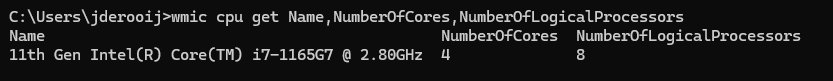
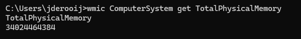
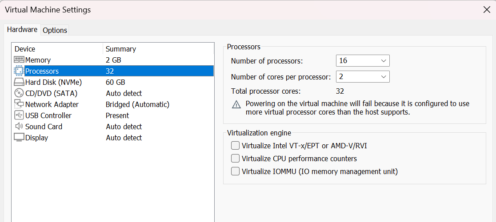
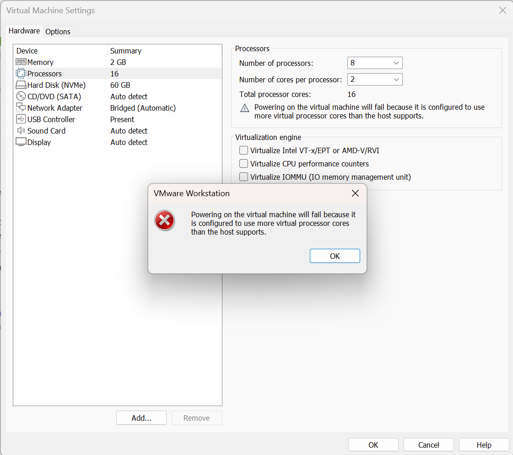
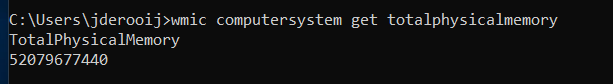
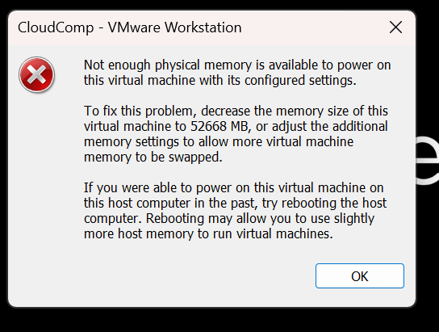

# KN01
## A) Hypervisor Typ 1 und 2 
### Hypervisor 

Ein Hypervisor ist eine Software, mit der man mehrere virtuelle Maschinen auf einer einzigen physischen Maschine ausführen kann. 
Jede virtuelle Maschine hat ihr eigenes Betriebssystem und ihre eigenen Anwendungen.
Er ist als Virtualisierungsschicht zuständig zwischen der Hardware und den Betriebssystemen der VMs, weist die physischen Ressourcen wie CPU,
Arbeitsspeicher und Speicher zu und sorgt für eine unabhängige Ausführung der einzelnen VMs. 

### Hypervisor Typ 1
Ein Hypervisor Typ 1 wird direkt auf der Hardware des Hosts ausgeführt, um Guest-Betriebssysteme zu verwalten. 
Die VM-Ressourcen werden vom Hypervisor direkt der Hardware zugewiesen. 
Ein Beispiel wäre Microsoft Hyper-V.

### Hypervisor Typ 2
Ein Hypervisor Typ 2 wird als gehosteter Hypervisor bezeichnet und wird auf einem Betriebssystem als Softwareschicht oder Anwendung ausgeführt.
Ein Beispiel hier wäre VMWare Workstation.

Quelle: https://www.redhat.com/de/topics/virtualization/what-is-a-hypervisor

## B) Virtualisierungssoftware 

Vermutung: VMware ist Hypervisor Typ 2, da es auf dem OS läuft und ein UI besitzt, was Hypervisor Typ 1 nicht oft haben.

Logische Prozessoren auf dem Host:

RAM auf dem Host:

Zuweisung zu vieler Prozessoren als Host besitzt an die VM:

Fehlermeldung beim Starten:

Zuweisung zu viel RAM als Host besitzt an die VM:

RAM auf der VM:

Erneuter Versuch (Fehler):

Erklärung:
Das UI von VMWare Workstation begrenzt auf dem Hypervisor Typ 2 die Anzahl vergebbarer Prozessoren und die des RAMs je nach Verfügbarkeit auf dem Host.

Dagegen liess sich zuvor problemlos mehr RAM zuweisen. Das passiert aufgrund des Swappings, dabei werden Speicheranteile effizient verwaltet und ausgelagert.
Ein anderer Grund ist das Ballooning, wo die VM den ungenutzten Speicher zurück an den Hypervisor gibt.
Das Ganze Konzept nennt sich Memory Overcommitment.

Unsere Vermutung hat sich damit bestätigt, VMWare Workstation ist ein Hypervisor von Typ 2.
