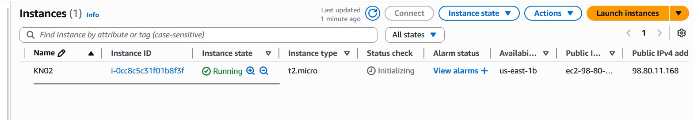
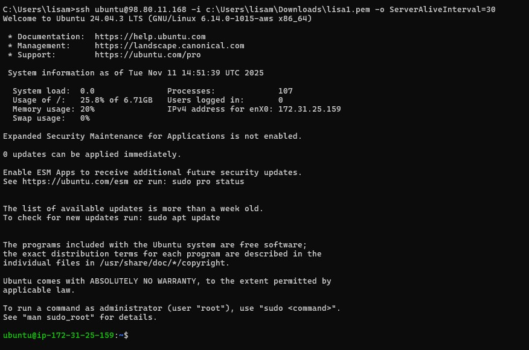
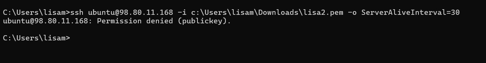
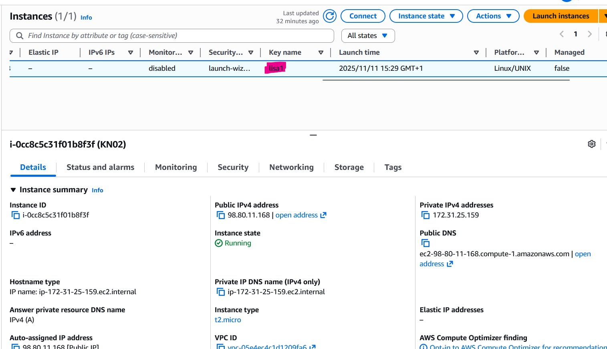

# KN02


## Einstellungen der Instanz
Diskgrösse / Volumen: 8 GiB
Betriebssystem: Linux/UNIX
RAM: t2.micro --> 1 GiB
CPU: 1 vCPU (virtuelle CPU)

## SSH
### Key 1
```bash
ssh ubuntu@98.80.11.168 -i c:\Users\lisam\Downloads\lisa1.pem -o ServerAliveInterval=30
```



### Erklärung:
Es funktioniert, weil die Instanz den Key 1 benutzt.

### Key 2
```bash
ssh ubuntu@98.80.11.168 -i c:\Users\lisam\Downloads\lisa2.pem -o ServerAliveInterval=30
```



### Erklärung:
Es funktioniert, weil die Instanz den Key 2 nicht benutzt.

## Instanz Detail



