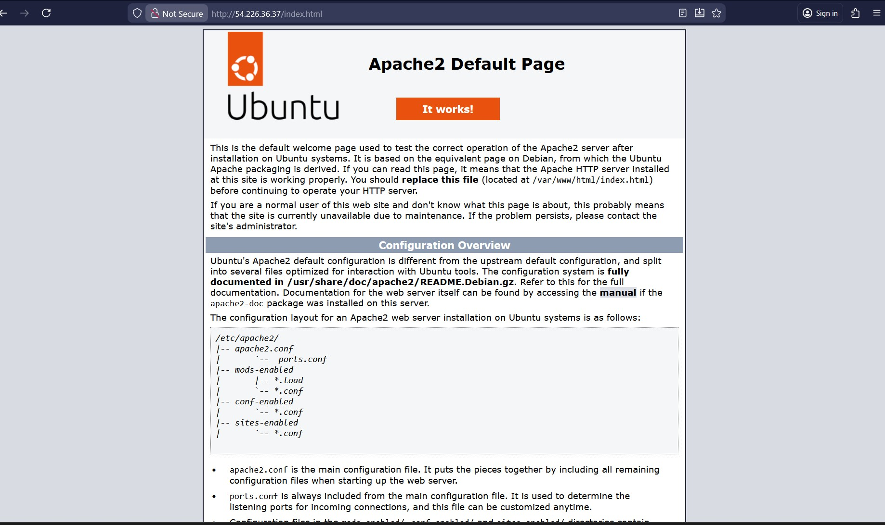
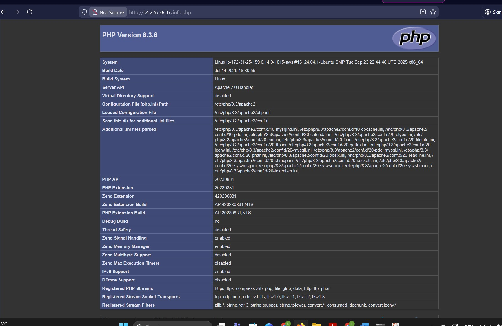
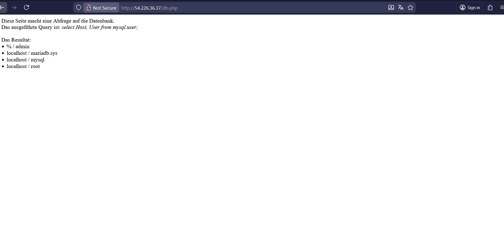
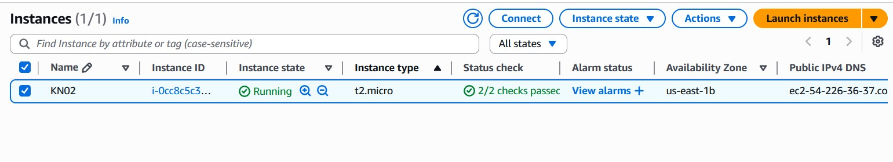
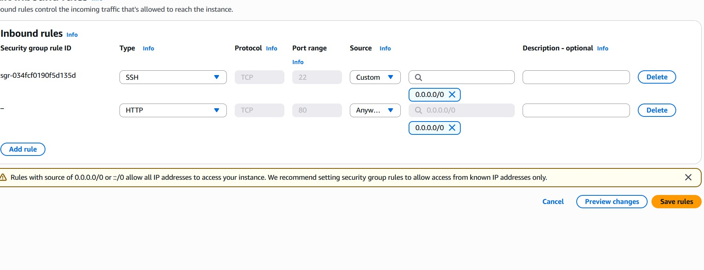
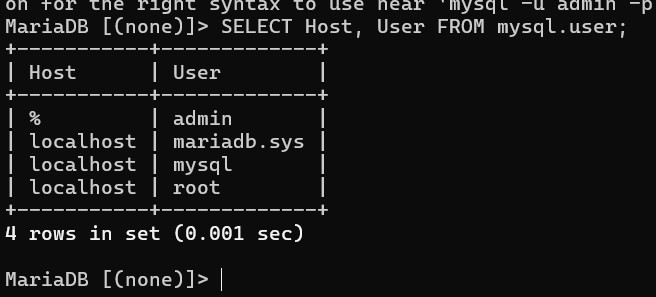

# KN03 

## Websites

## Aktive Instanz

## Security Settings

## SQL Abfrage

## Erklärung
Sie zeigt alle Benutzer in der MySQL-Datenbank an.
Es zeigt welche User es in dieser Tabelle gibt und was ihre dazugehörigen Hosts sind.
Damit kann man überprüfen, ob der Benutzer admin von überall (%) zugreifen darf.
