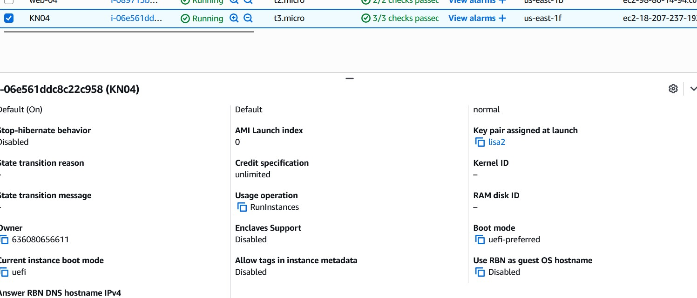
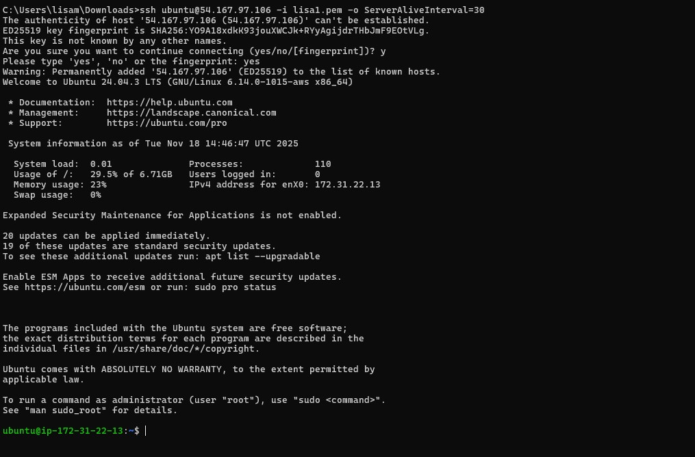
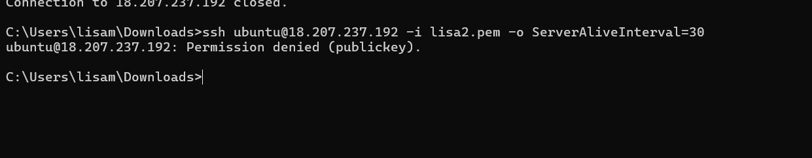
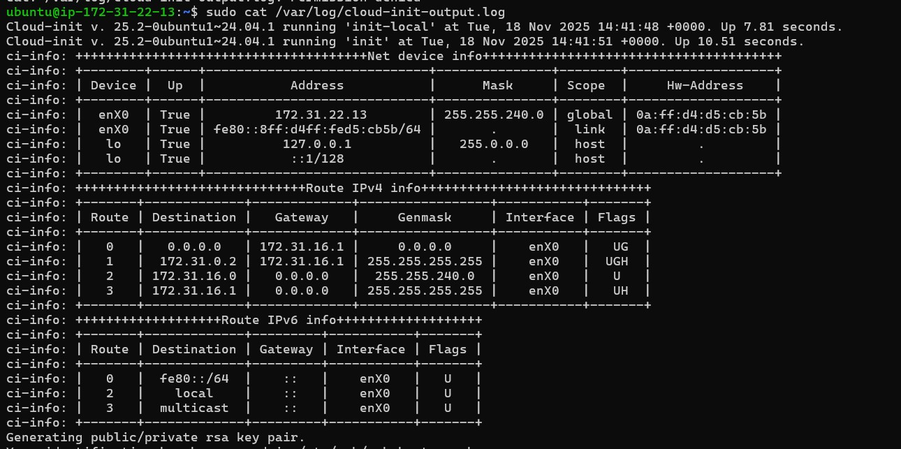
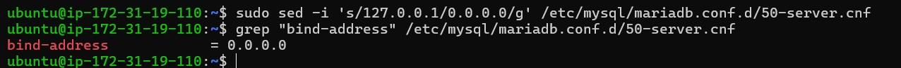
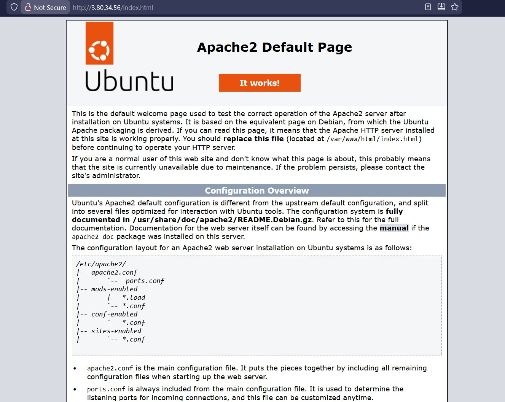
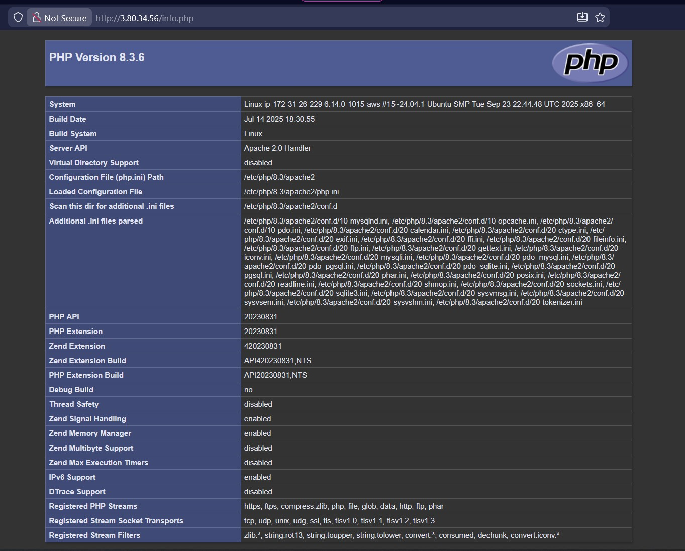
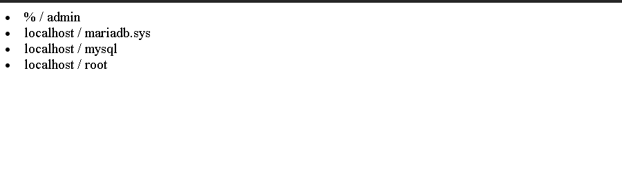
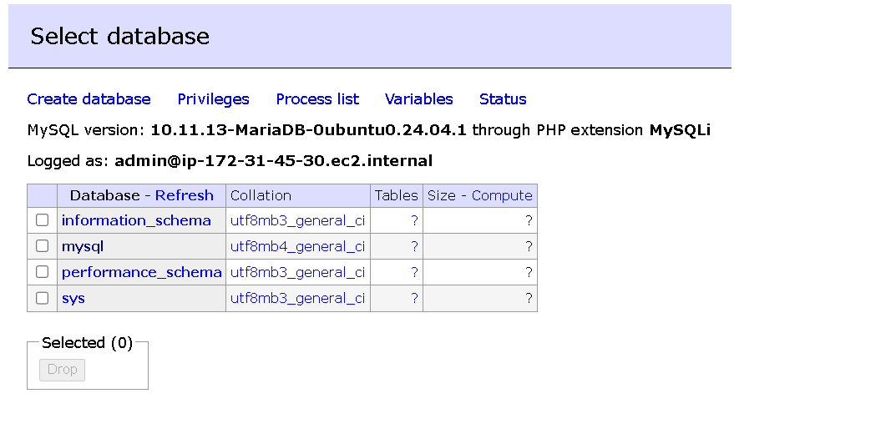

# KN04 - Cloud-init und AWS

**Datum:** 18.11.2025

---
# Teil A – Cloud-init Datei Verstehen (10%)

### Erklärung des YAML-files

```yaml
#cloud-config #sagt das es eine cloud-init Konfiguration ist
users: # User-Konfiguration
- name: ubuntu # erstellt User namens ubuntu
  groups: [users, admin] # fügt zu den Gruppen users und admin hinzu
  shell: /bin/bash # Bash als default Konsole
  sudo: ALL=(ALL) NOPASSWD:ALL # sudo Recht ohne Passwort
  ssh_authorized_keys: # definiert Einstellungen für authorized keys für User
    - ssh-rsa AAAAB3NzaC1yc2EAAAADAQABAAABAQC0WGP1EZykEtv5YGC9nMiPFW3U3DmZNzKFO5nEu6uozEHh4jLZzPNHSrfFTuQ2GnRDSt+XbOtTLdcj26+iPNiFoFha42aCIzYjt6V8Z+SQ9pzF4jPPzxwXfDdkEWylgoNnZ+4MG1lNFqa8aO7F62tX0Yj5khjC0Bs7Mb2cHLx1XZaxJV6qSaulDuBbLYe8QUZXkMc7wmob3PM0kflfolR3LE7LResIHWa4j4FL6r5cQmFlDU2BDPpKMFMGUfRSFiUtaWBNXFOWHQBC2+uKmuMPYP4vJC9sBgqMvPN/X2KyemqdMvdKXnCfrzadHuSSJYEzD64Cve5Zl9yVvY4AqyBD aws-key # public key
ssh_pwauth: false # deaktiviert Passwort für SSH Zugriff
disable_root: false # Root user bleibt bestehen
package_update: true # beim ersten Boot werden die Packages geupdated
packages: # Konfiguration für Packages die installiert werden sollen 
- curl # installiert curl CLI (data transfer)
- wget # installiert wget CLI (file downloader)
```
# Teil B
### Instanz Details


### Key 1 Success
```bash
ssh ubuntu@54.167.97.106 -i lisa1.pem -o ServerAliveInterval=30
```


### Key 2 fail
```bash
ssh ubuntu@54.167.97.106 -i lisa2.pem -o ServerAliveInterval=30
```


### Cloud init log



### DB Connection öffnen

### Index


### PHP



### DB


### Adminer


 
