# Teil A - Grundbegriffe erklären

### VPC
Die Virtual Private Cloud bezeichnet einen abgetrennten und privaten IP-Adressbereich eines Anbieters, in unserem Fall AWS.
Man kann darin bspw. Instanzen erstellen, Regeln anpassen...

### Subnetz
Ein Subnetz ist ein teilbereich innerhalb der VPC, der einen gewissen IP-Adressbereich darstellt.
Innerhalb des Subnetzes können instanzen über ihre private IP kommunizieren.

### Public IP
Die öffentliche IP ist innerhalb des globalen Internets und wird durch den ISP zugewiesen.
In der Cloud: von AWS zugewiesen

### Private IP
Die private IP ist im lokalen Netzwerk. Sie wird in privaten Haushalten durch den Router vergeben.
Sie ist da, um eine konsistenze Kommunikation innerhalb des eigenen Netzes (bspw. Webserver -> DB) zu ermöglichen.
In der Cloud: von AWS innerhalb eines Subnetzes zugewiesen

### Static IP
Die statische IP (egal ob private oder public) bleibt gleich, während dynamische IPs sich immer wieder abändern.

### Subnetz Namen angepasst
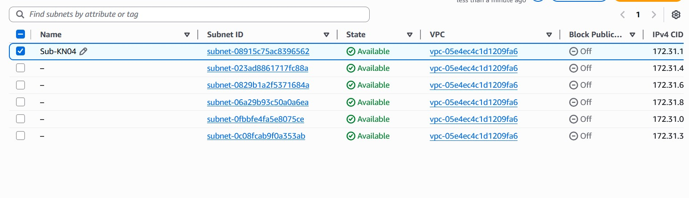

### DB IP 
172.31.50.10

### Web IP
172.31.55.150 

### Security Group
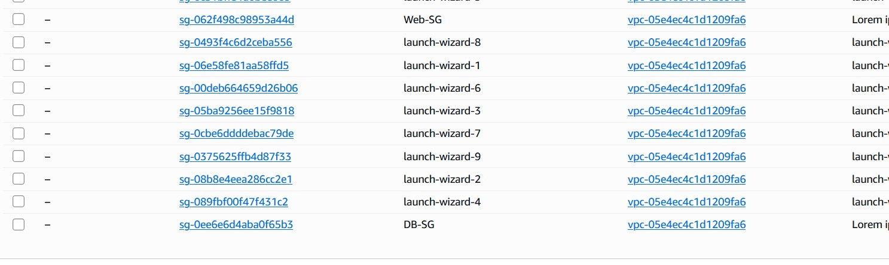

### SG DB
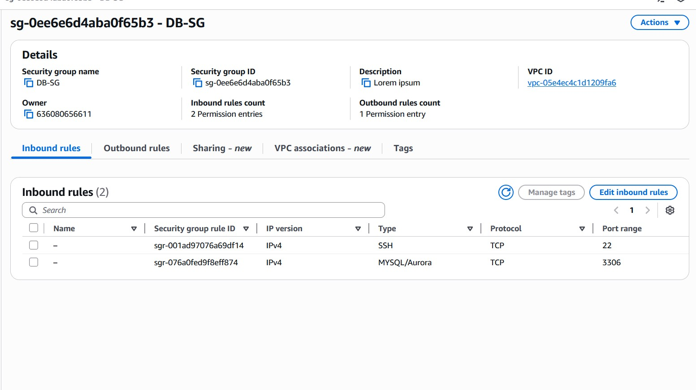

### SG web
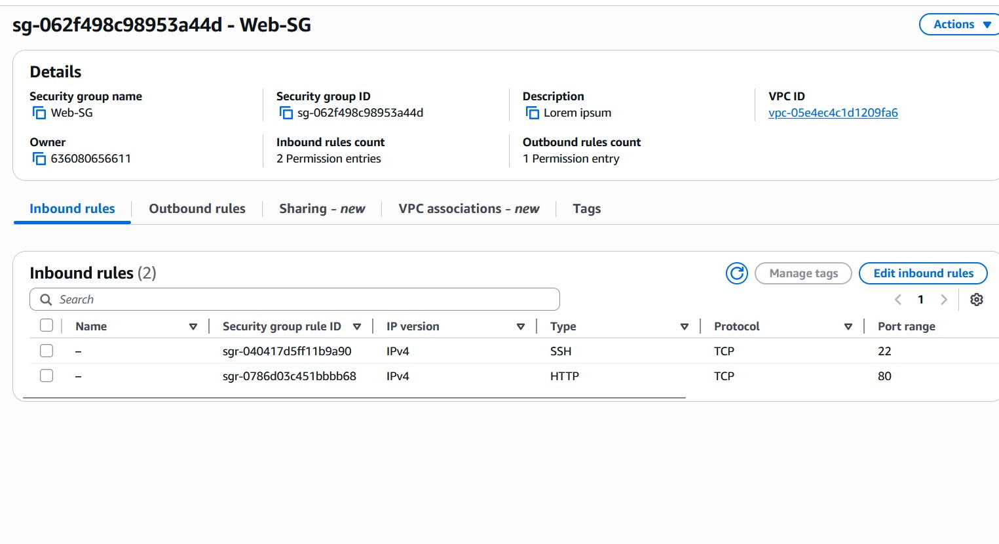

### Öffentliche IP
### SG DB
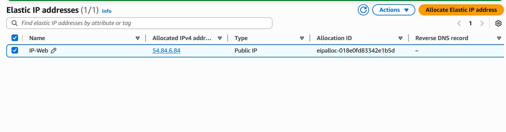

### Gestoppte Instanzen
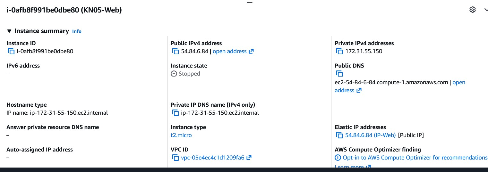

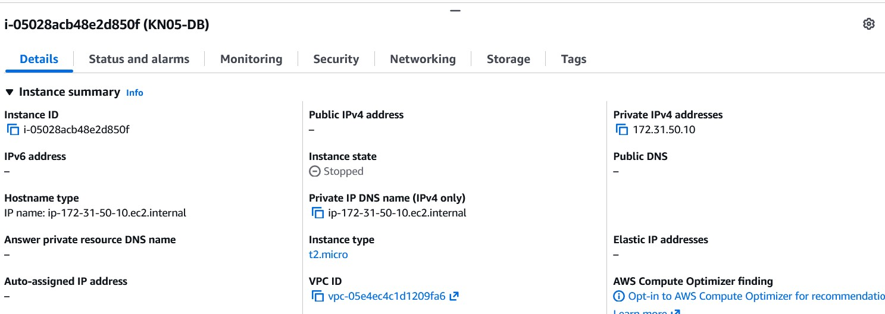

### Gestartete Instanzen
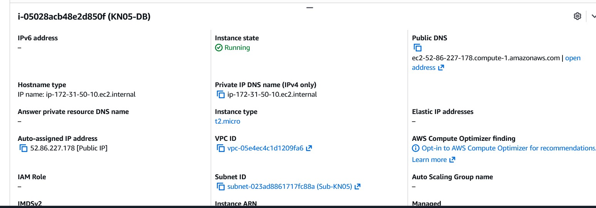

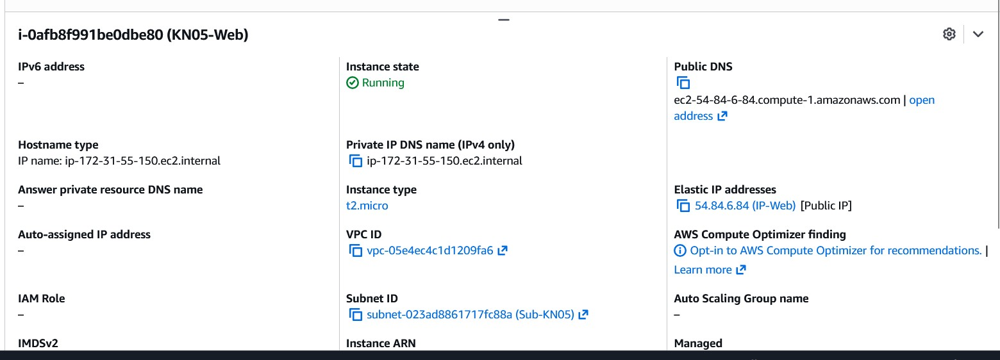

### Websiten

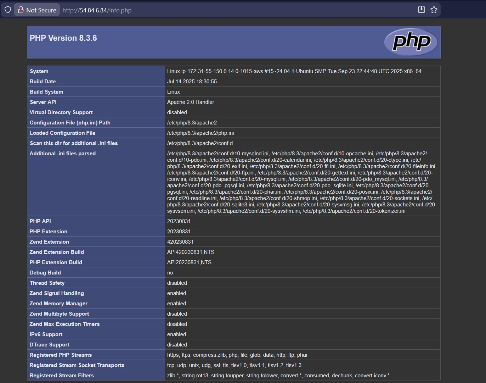

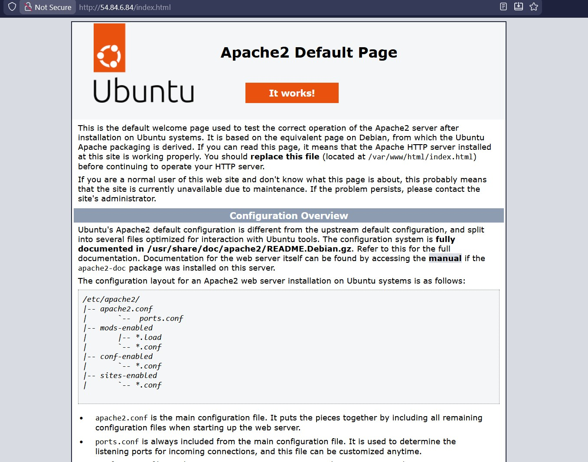

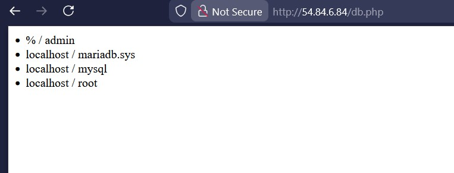

