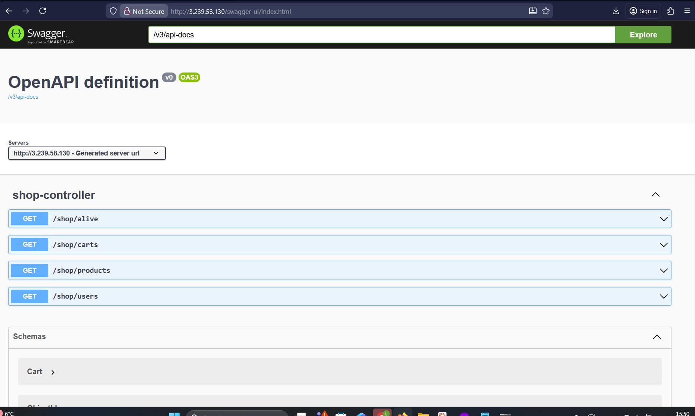
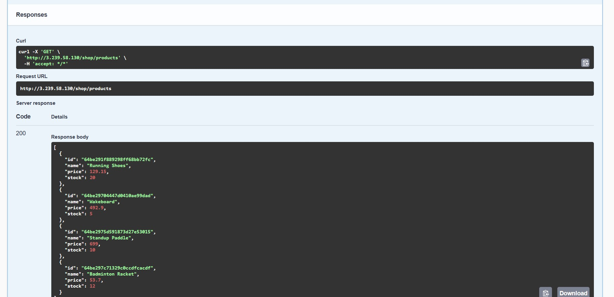
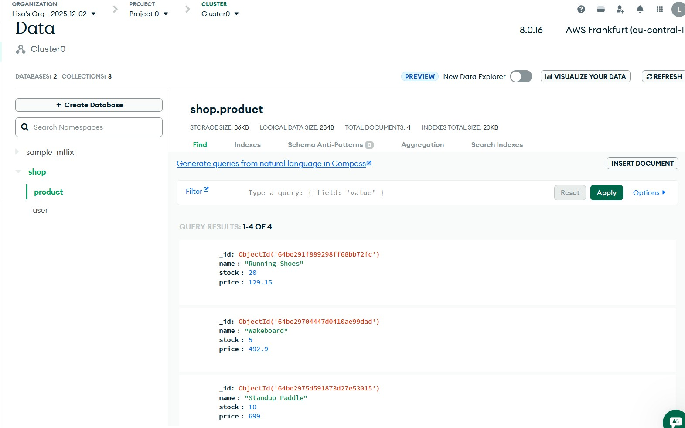

# KN06
## Teil A
## Reverse Proxy 
Ein Reverse Proxy ist ein Server, der zwischen dem Client (z.B. Browser) und einem oder mehreren internen Servern steht.
Er nimmt Anfragen aus dem Internet entgegen und leitet sie intern an den richtigen Dienst weiter.
Er leitet Anfragen auf mehrere Backend-Server weiter --> mehr Performance

## Welche Teile der Cloud-Init datei machen keinen Sinn?

## Swagger UI

## products endpoint

## MongoDB collections

