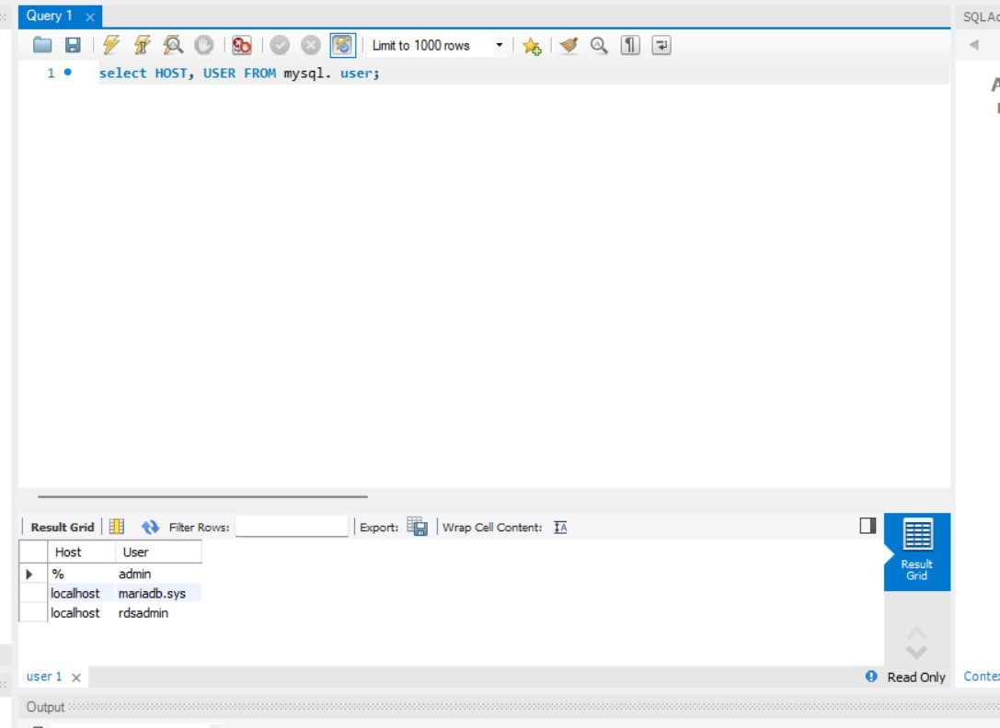
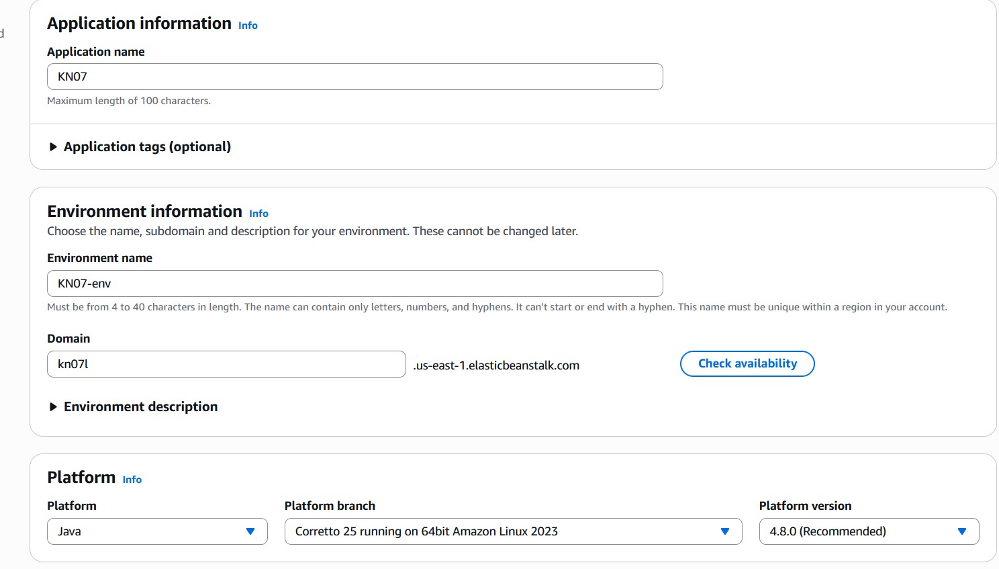
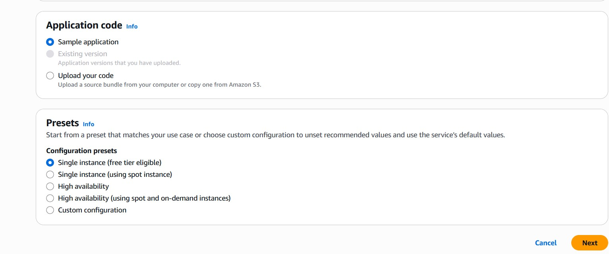
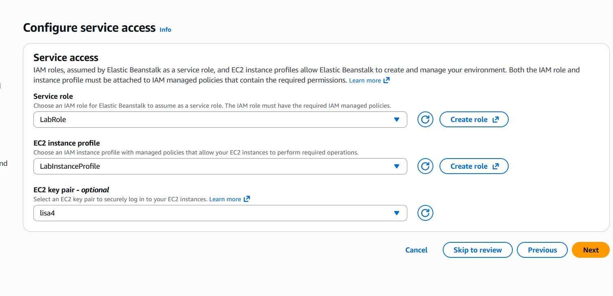
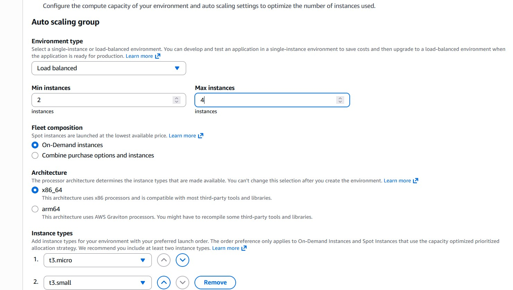
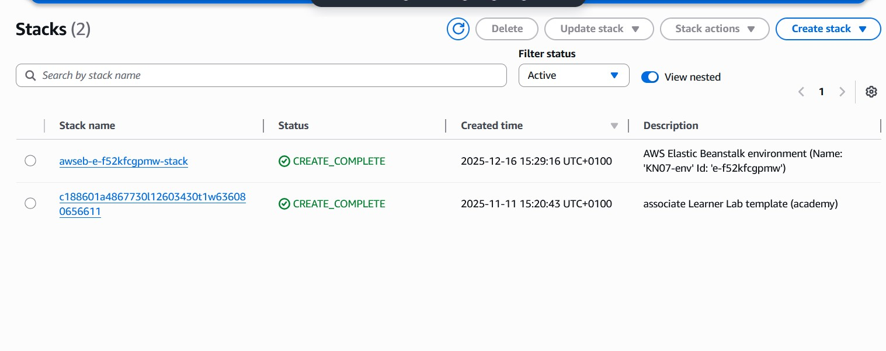
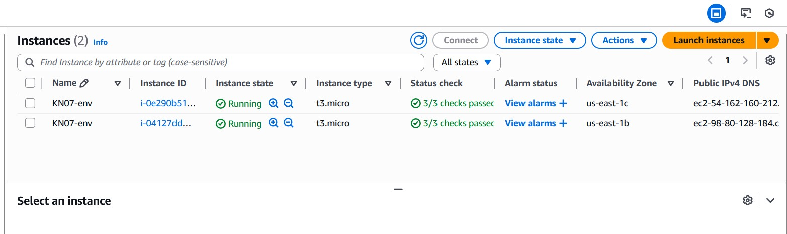

# Teil A

## Warum PAAS oder SAAS statt eine eigene Datenbank installieren?

Die Verwendung eines PAAS- oder SAAS-Dienstes wie AWS RDS bietet gegenüber einer selbst installierten Datenbank mehrere Vorteile:

Kein Server-Management: Betriebssystem, Datenbankinstallation, Updates werden vom Anbieter übernommen.

Automatische Backups: Datensicherungen laufen automatisch und zuverlässig.

Hohe Verfügbarkeit: Der Anbieter sorgt für Ausfallsicherheit und Redundanz.

Einfache Skalierbarkeit: Speicher und Leistung können bei Bedarf schnell angepasst werden.

Integrierte Sicherheit: Sicherheitsupdates, Monitoring und Zugriffskontrollen sind bereits enthalten.

# Teil B

Ich habe als Plattform Java mit Amazon Corretto 25 und als Applikation eine Beispielsapplikation ausgewählt.
Den Default der Konfigurationsvoreinstellung habe ich beibehalten (Single-Instance).

Als Servicerolle habe ich die LabRole und als EC2-Instance-Profile habe ich das LabInstanceProfile genommen.
Falls ich mich später noch per SSH einloggen will, habe ich meinen ersten Key angegeben.

Hier habe ich einen Load Balancer ausgewählt. Damit wird der Load Balancer, Target Groups und Autoscaling erstellt. Ausserdem habe ich wie bei KN06 mindestens 2 und höchstens 4 Instanzen ausgewählt, da dies die Standard Einstellung ist.

# Teil C
## Unterschied KN06
Bei Beanstalk werden Target Groups, Autoscaling, Instanzen und Loadbalancer automatisch erstellt und konfiguriert. 
Bei KN06 musste man das manuell einstellen. 

## CloudFormation
AWS CloudFormation ist eib Dienst von AWS, der es Benutzern ermöglicht, Infrastrukturressourcen automatisiert und sicher zu modellieren und zu verwalten.

### Unterschied CloudFormation und Cloud Init
Cloud Init: konfiguriert die erstellten Instanz

CloudFormation: erstellt die Infrastruktur, erstellt die Instanzen

