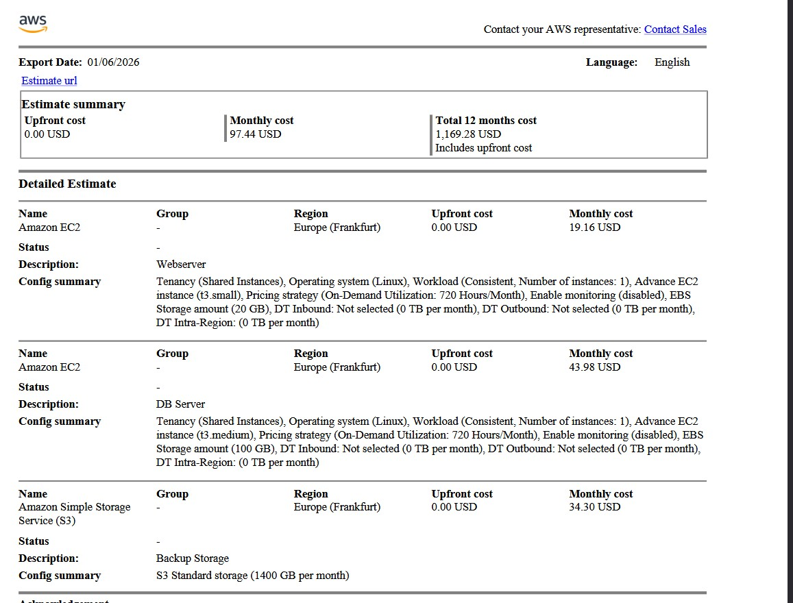
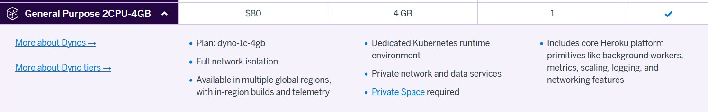
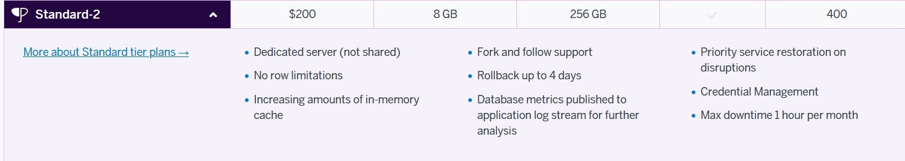
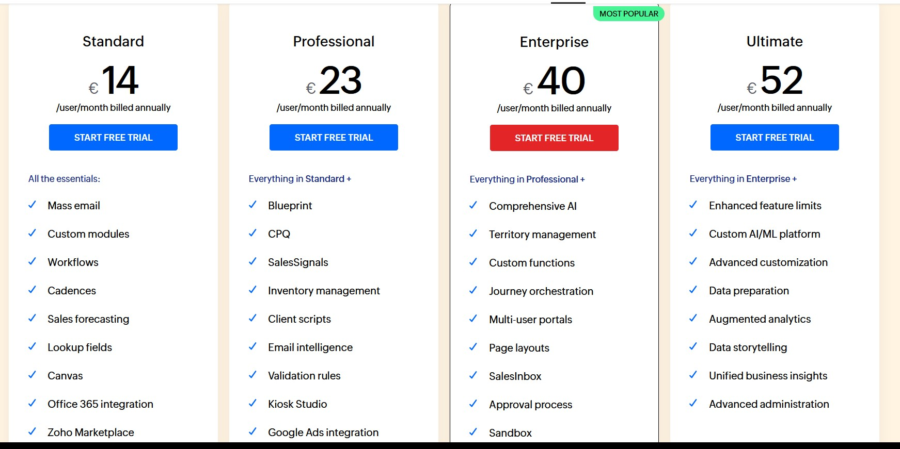
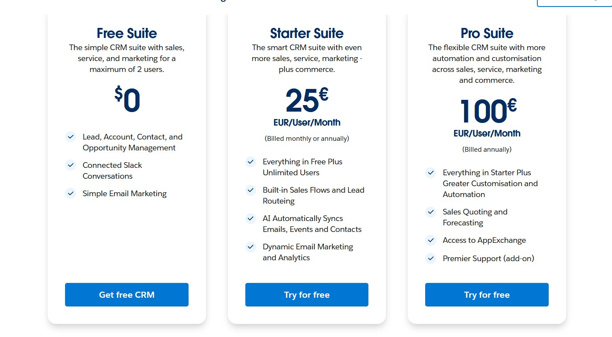

# KN10 - Kostenbrechnung

## A) Kostenrechnung IAAS - Rehosting

### AWS

### Azure

### Unterschiede zu On-Prem
Um absoluten Datenschutz und gleichzeitig niedrige Latenz zu gewährleisten, wurde als Region Nord-Europa gewählt.
Durch den leicht erhöhten und gleichzeitig effizienten Hot Storage in der Cloud ist die Speicherung der Backups zuverlässiger und sofort verfügbar, 
während On-Premise Backups lokal und oft nur begrenzt redundant waren.
Die Backups werden automatisch in der Cloud verwaltet.
Cloud-Ressourcen können bei Bedarf schnell erweitert werden, On-Premise wäre ein Hardware-Upgrade nötig gewesen.
Dadurch ist die Anwendung leicht skalierbar.

PS: Unsere Top-Arbeit verdient eine Gehaltserhöhung.

## B) Kostenrechnung PAAS - Replattforming

Dieser Cloud-Dienst bietet mehr RAM als die Vorgaben. Der Grund hierfür ist, dass ich der Meinung bin, dass es besser ist, wenn es zu viel Speicher hat anstatt zu wenig. Es gibt kein günstigeren Dienst, der passend ist zu den Anforderungen. 

Hier war wieder das Gleiche. Entweder zu wenig Ressourcen oder zu viel. Ich habe zu viel ausgewählt, da man das Produkt am laufen halten kann, was mit zu wenig Ressourcen schwierig werden kann.

## C) Kostenrechnung SAAS - Repurchasing

Ich würde die Enterprisevariante wählen.
Die Enterprisevariante eignet sich für mittelgrosse Unternehmen (wie eben 30 Mitarbeitende) gut,
da wir damit einen Funktionsumfang erhalten, der unsere bisherige, 
individuell entwickelte CRM-Lösung realistisch ersetzen kann.
Sie bietet erweiterte Automatisierungen, Anpassungsmöglichkeiten sowie detaillierte Auswertungen,
ohne dass zusätzlicher interner IT-Betrieb notwendig ist. (alle wurden entlassen)

Bei SalesForce hat eine kleine Auswahl an Diensten. Ich würde das Angebot von 100 Fr. pro Monat wählen. Zwar kostet dieser Dienst viel, jedoch ist es passend für die Anforderungen. Und zwar gibt es eine gute Benutzbarkeit von 30 Users, gute Flexibilität, Skalierbarkeit und eigene Anpassungen am Produkt.

## D) Interpretation der Resultate
Kosten
Die IaaS-Lösungen (AWS und Azure) haben vergleichsweise tiefe direkte Infrastrukturkosten. Zusätzlich entstehen jedoch Kosten, die in den Kalkulatoren nur teilweise sichtbar sind, wie Administration, Monitoring, Sicherheitskonfiguration und Wartung. Die Preisunterschiede zwischen AWS und Azure ergeben sich hauptsächlich durch unterschiedliche VM- und Storage-Staffelungen und sind nachvollziehbar.
Heroku (PaaS) ist monatlich teurer als IaaS, beinhaltet jedoch bereits viele Leistungen wie Plattformbetrieb, vereinfachte Backups und grundlegendes Monitoring. Dadurch reduzieren sich indirekte Kosten und interner Aufwand.
Die SaaS-Lösungen (Zoho CRM und Salesforce) sind auf den ersten Blick am teuersten, da pro Benutzer abgerechnet wird. Dafür sind Server, Backups, Updates, Sicherheit und Verfügbarkeit vollständig im Preis enthalten. Zusätzliche Infrastrukturkosten fallen nicht an.
Aufwand für die Firma
Bei IaaS bleibt der Betriebsaufwand hoch, da die Firma weiterhin für Serverbetrieb, Backups, Monitoring und Sicherheit verantwortlich ist.
PaaS reduziert diesen Aufwand deutlich, da viele technische Aufgaben vom Anbieter übernommen werden.
SaaS verursacht den geringsten Aufwand, da die Firma nur noch Benutzer und Prozesse verwaltet, nicht aber die IT-Infrastruktur.
Fazit
IaaS ist kostengünstig, erfordert jedoch hohen internen Aufwand.
PaaS stellt einen guten Mittelweg dar.
SaaS ist am einfachsten im Betrieb, aber mit höheren Lizenzkosten verbunden.

